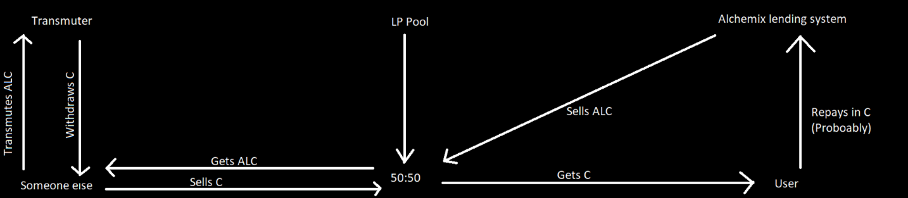
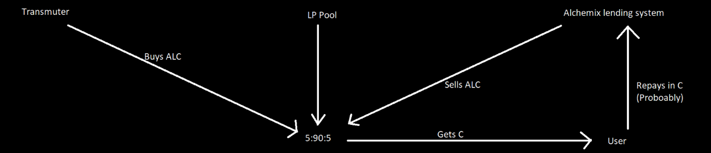
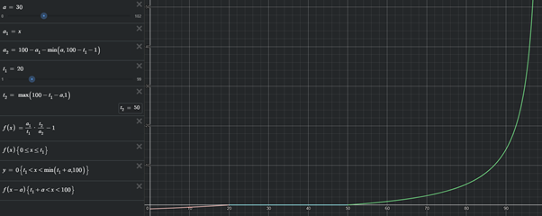

# Hybrid pools and the Transmuter,

# Increasing capital efficiency.

Getting deeper liquidity, and better returns for liquidity providers

Increasing capital efficiency - that is the main aim of all these defi products – allow people to do more with their money. The aim of this is to talk through the concept of a hybrid pool, explain what it is, what it may be able to achieve, the potential drawbacks and risks. A hybrid pool is where some proportion of the funds are kept in another yield accrual protocol and then withdrawn and swapped out when trades are executed. This is then linked into the transmuter as an active balancing feature, to maximise yield for the debt that needs re-paying and the overall stability of the system.

Some terminology:

AL(ETH/USD/BTC/…) = ALC

coin = C

where &quot;C&quot; can be any coin that Alchemix decides to add later.

YC = yearn Coin (whenever some quantity of YC is counted its always the amount of YC \* the return ratio)

arb = arbitrage

LP = Liquidity Providers

Life as we know it:

The transmuter allows people to have their ALC converted to C this helps keep the peg between ALC and C. The Curve LP pool provides liquidity between the ALC and C pair, so people can swap out of the less useful coin into the more useful one. The site allows repayment in either ALC or C so there is no difference there and no reason to swap back into the ALC coin. What this means is that there is constant selling pressure on the ALC to C side, so it is constantly needing to be arbitraged.

Problems and inefficiencies with the current system:

You have constant selling pressure, meaning someone has to arb the other way. Then they can take their ALC stick it in the transmuter to convert it to C, so they and keep on arbing back. This is a wasteful process that siphons funds out of the Alchemix eco system, reducing the yield for users and thus the transmuter. It also means that for most blocks in eth the LPers capital is not doing anything, this is again a waste.

Good parts of the current system:

It is more distributed and thus safer. The transmuter is not in the same smart contract as the ALC/C pool if something goes wrong in the ALC/C pool or the transmuter these are isolated and thus more protected. If they where all combined then there would be a risk that all of it can break at once, be that in a hack or a bug. If the number of attack vectors are reduced, then an overall safer environment is achieved.

What is a hybrid pool:

The overarching aim of a hybrid pool is to increase the amount of time that the capital inside of the pool is being &quot;put to work&quot;. An easy and straightforward way of achieving that is by putting some of the assets inside of a Yearn vault and integrating the transmuter all into one thing. So if the pool has an 5:90:5 split (numbers can be changed) with the assets ALC:YC:C. The yield from all the liquidity inside of the pool acts like additional deposits inside of the Alchemix ecosystem, increasing the yield and providing additional funding for the transmuter to help it rebalance itself. The number of coins inside of the YC section is measured as the amount of C that it holds, not the raw amount of YC, this means that as yield is generated for the LPers, the amount of liquidity inside of the system increases over time. To the user, they will just a see a 5:95 pool (ALC:C) and all of this will be abstracted away behind the scenes.

How do the different processes inside of the pool work:

The transmuter:

When the call goes to yearn to draw down all the coinage and it performs the rebalancing, it calls the yearn rebalance function to withdraw/deposit YC/C from/to yearn to the pool to keep the 90:5 (YC:C) ratio constant between them, then it sells YC and C into the pool to get it rebalanced between (ALC:YC:C).

Swaps:

If the swap amount is over some threshold as a proportion of coins in the pool, then the YC are swapped back into C on their way out. This means that because we have larger liquidity from all the funds in the Yearn pool the whales (the people affected most by low liquidity) will be grateful for the lower slippage and wont mind the extra gas cost of drawing coins down from yearn. The smaller fishes will not have to draw down from yearn and instead will be paid out from the smaller 5% C pool.

LPers:

The pool works normally with the transmuter/yearn draw down process acting as a stability mechanism on top. The LP tokens can be staked for ALCX rewards normally. The pool allows deposits normally and has all the features of a curve pool.

The Scoopy is in the detail:

This section is going to be a more detailed in-depth description of how the whole system could work.

The current system for reference:

The hybrid pool for reference:

The best way to think of this may be to imagine the curve pool sitting in the centre with all the additional addons floating around it on the outside, like the core curve pool is the same thing. Tacked on is the transmuter and a function to manage swaps in and out of the pool for the YC \&lt;-\&gt; C. the list of functions that are call able that are now either changed or new are:

- Swaps in and out of the pool
- LP additions
- Transmuter rebalance feature

Swaps in the pool work like so:

Whale Swap ALC-\&gt;C – if (slippage to C \&gt; slippage to YC + yearn withdraw fee)

Swaps from ALC to YC

Withdraws YC from yearn and receives C

Whale Swap C -\&gt; ALC if (pool fee \&gt; gas cost to rebalance the pool (between YC and C))

Swaps from C to ALC with no pool fee (all the YC and C is counted as the same token, so we get that 5:95 ratio)

Then they pay for the rebalance of the pool, be that add or take out C from Yearn to reach that 90:5 ratio between them.

Shrimp Swap ALC-\&gt;C

It&#39;s a normal curve pool swap from ALC to C

Shrimp Swap C -\&gt; ALC

It&#39;s a normal curve pool swap from C to ALC

LP additions:

Happen normally, the rebalancing between ALC:YC:C happens in the swaps

Transmuter rebalance:

It calls the yearn rebalance function, then it finds out how much YC and C it needs to sell into the pool to get the ratio back to normal; sells that much and burns the ALC it bought back.

Its pegging time:

The most important consideration that sits above all this; the overarching aim is keeping that peg. The measure of the peg is the price of ALC compared to C. so a value of 0 is on peg, 0.5 if 50% over C and -0.5 is 50% below C. if it&#39;s on peg is determined as such:

there are 3, technically 5 variables that go into an on or off peg scenario; the 5 variables are:

a = how much ALC can the transmuter buy up as a % of coins in the pool

a­1 = proportion of ALC that makes up the pool

a2 = proportion of YC+C that makes up the pool (100% - a­1)

t­1 = target proportion of ALC in the pool

t2 = target proportion of YC+C in the pool (100% - t­1)

the red and green sections are the same curve shifted in the x axis by the amount of tokens that the transmuter can buy up because that&#39;s the balancing mechanism and so if it can buy up all those tokens then it can be easily made to be on &quot;peg&quot; allowing large amounts of selling on the ALC side and for it to still be able to keep its peg.

Cucky Curve:

Curve finance do not allow for people to modify their code so a new kind of LP pool will need to be devised. Building from the peg definition that was described earlier a UniSwap V2 pool and a constant price curve can be combined to provide 0 slippage over certain ranges and then the usual V2 curve elsewhere. The graph below shows the same curve but with different scaling&#39;s, the one that looks like a stable swap curve is where the assets are 1:1 inside of the pool. The &quot;weird&quot; looking on represents a curve with a 1:5 ratio. The weird thing about this is that regardless of the ratios they will all sample a curve that looks like the 1:1 one. This is because the values will be scaled and normalised so that a 1:5 pool will behave like it is on a 1:1 curve.

All of these examples simulate a pool with only 2 assets, this is still applicable as the YC/C coins are abstracted away to 1 coin in the background creating multiple curves but only showing one.

Long term risk to the protocol that a hybrid pool helps to address:

Currently we are &quot;paying&quot; people to provide liquidity to the protocol, and to do this we are using ALCX tokens. The issue arises that if ALCX does not outperform or match all assets we bring onto the platform then we run the risk of not being able to financially incentivise people to provide liquidity in the quantities that are required to do so. If ALCX falls by 50% we are now paying people 50% less for liquidity provision and thus it follows that there will be less liquidity for the system. If we have a hybrid pool then they will be earning returns on top of the LP fees at whatever yield source is being used % reducing the ALCX price risk.

Summary:

There seems to be a lot of positive reasons to do this, but it is a big project and would of course be a large undertaking, with many risks stemming just from the complexity of the project alone. I think I am to biased to really look critically at this proposal, so I now hand it over to you, the reader to message me @biddls.eth and roast the hell out of my idea. And hopefully after a nice bit of barbequing we will get a juicy proposal.

What needs more development:

- The 5:90:5 ratio needs more discussion; it could start out closer to a 3rd for each and then rebalance over time.
- When Alchemix is deployed on a L2 the pool could just be a ALC:YC pool, due to the lower fees.